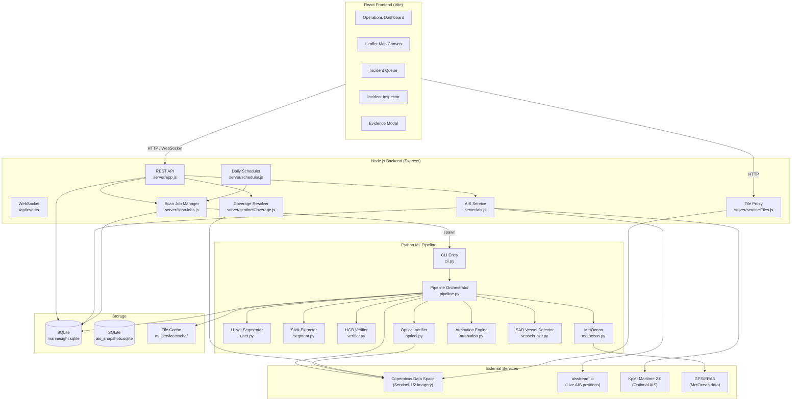
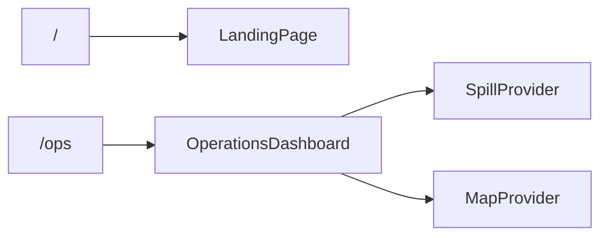
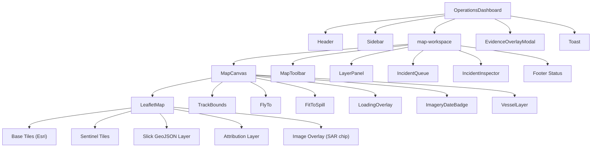
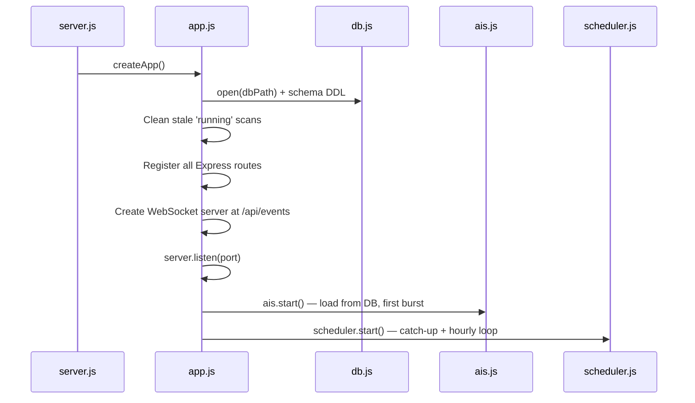
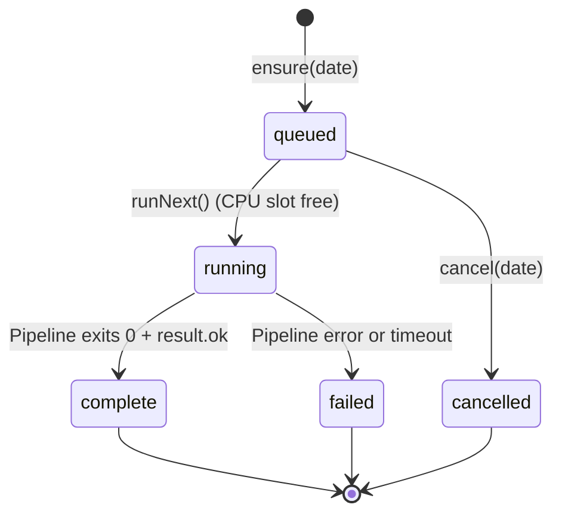
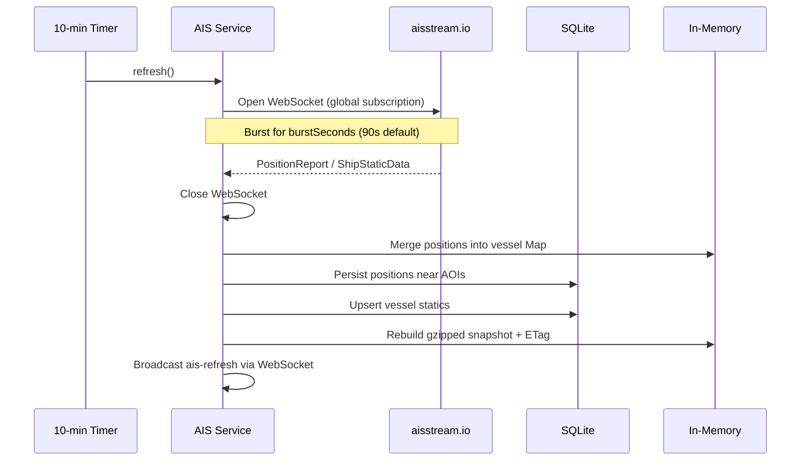
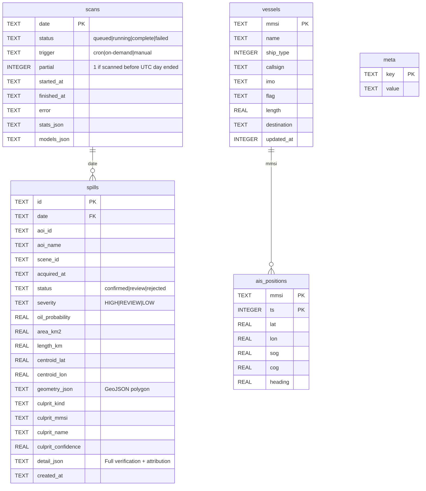
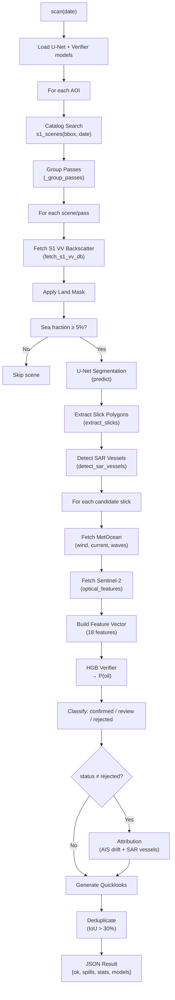
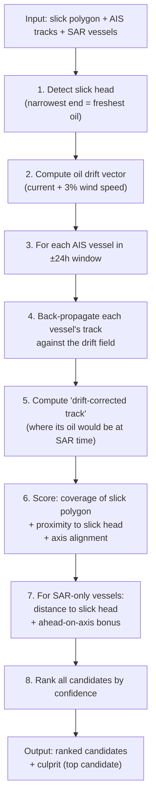
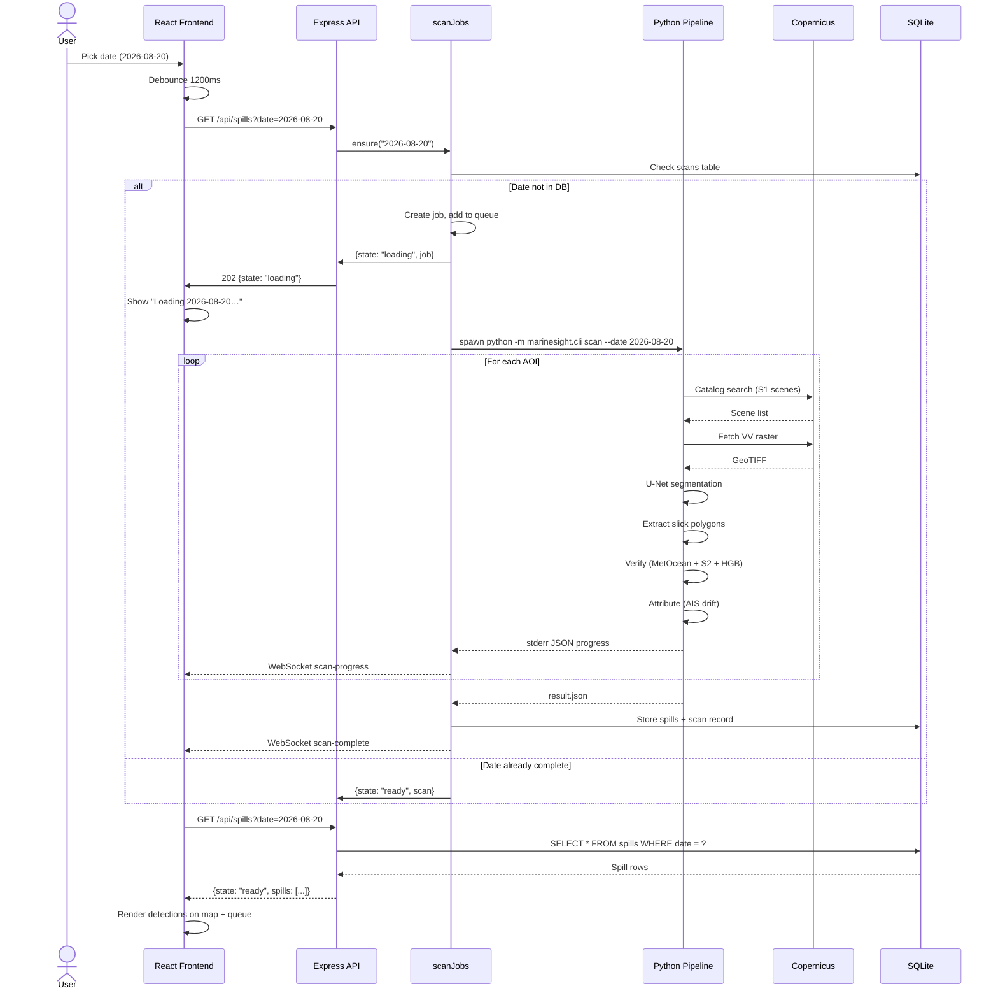

# MarineSight — System Architecture

> **Maritime oil-spill detection platform** — Sentinel-1 SAR segmentation, multi-modal verification, AIS vessel attribution, and a real-time operations dashboard.

---

## 1. System Overview

MarineSight is a full-stack application for **automated oil-spill detection and monitoring** in maritime areas. It combines satellite radar imagery (Sentinel-1), optical imagery (Sentinel-2), meteorological/oceanographic data, and live AIS vessel tracking to detect oil slicks, verify them, and attribute them to likely source vessels.



---

## 2. Technology Stack

| Layer | Technology | Version |
|-------|-----------|---------|
| **Frontend** | React + Vite | React 18.3, Vite 5.4 |
| **Map** | Leaflet + react-leaflet | Leaflet 1.9, react-leaflet 4.2 |
| **Routing** | react-router-dom | 6.30 |
| **UI Framework** | Bootstrap + Bootstrap Icons | 5.3 |
| **Backend** | Node.js + Express | Express 4.21 |
| **WebSocket** | ws | 8.18 |
| **Database** | SQLite3 (WAL mode) | sqlite3 6.0 |
| **ML Runtime** | Python 3.10 + PyTorch | torch ≥2.2 |
| **Geospatial** | Shapely, GeoPandas, Rasterio | Shapely ≥2.0 |
| **ML Models** | scikit-learn (HGB), custom U-Net | scikit-learn ≥1.4 |
| **Imagery API** | Copernicus Data Space (Sentinel Hub) | STAC / Process API |
| **AIS Data** | aisstream.io WebSocket | v0 stream |
| **Build** | Vite (dev + prod) | 5.4 |

---

## 3. Project Structure

```
MarineSight/
├── server.js                    # Entry point — starts the Express server
├── index.html                   # Vite HTML shell
├── package.json                 # Node dependencies & scripts
├── vite.config.mjs              # Vite configuration with React plugin
├── .env / .env.example          # Environment configuration
├── styles.css                   # Global styles (26 KB)
│
├── server/                      # ── Node.js Backend ──
│   ├── app.js                   # Express app factory, all routes, WebSocket
│   ├── config.js                # Configuration from .env
│   ├── db.js                    # SQLite wrapper + schema DDL
│   ├── scanJobs.js              # ML pipeline job queue (single-flight per date)
│   ├── scheduler.js             # Daily cron: scan previous UTC day
│   ├── ais.js                   # AIS burst collection + in-memory cache
│   ├── cdseAuth.js              # Copernicus OAuth2 token management
│   ├── sentinelCoverage.js      # Resolve which satellite pass covers a view
│   ├── sentinelTiles.js         # Tile proxy for Sentinel imagery
│   └── test/                    # Backend test suite
│
├── src/                         # ── React Frontend ──
│   ├── main.jsx                 # React DOM root + BrowserRouter
│   ├── App.jsx                  # Route definitions (/ and /ops)
│   ├── app.css                  # Component-scoped styles (14 KB)
│   ├── context/
│   │   ├── SpillContext.jsx     # Central state: date, spills, scans, loading
│   │   └── MapContext.jsx       # Map mode, layer visibility, vessel filters
│   ├── pages/
│   │   ├── LandingPage.jsx      # Hero landing page
│   │   └── OperationsDashboard.jsx  # Main operations workspace
│   ├── components/
│   │   ├── common/
│   │   │   ├── Header.jsx       # Top bar: clock, notifications, new watch
│   │   │   ├── Sidebar.jsx      # Left nav: AOI selector, operations menu
│   │   │   └── Toast.jsx        # Notification toasts
│   │   ├── map/
│   │   │   ├── MapContainer.jsx # Leaflet map + all overlays (252 lines)
│   │   │   ├── MapToolbar.jsx   # Date picker, basemap mode switcher
│   │   │   ├── ImageryDateBadge.jsx # Shows actual acquisition date on screen
│   │   │   ├── LayerPanel.jsx   # Toggle layers & vessel type filters
│   │   │   └── VesselLayer.jsx  # AIS vessel rendering on map
│   │   ├── queue/
│   │   │   └── IncidentQueue.jsx # Detection list with severity filters
│   │   ├── inspector/
│   │   │   └── IncidentInspector.jsx # Detail panel: overview/verification/attribution
│   │   └── modals/
│   │       └── EvidenceOverlayModal.jsx # Side-by-side S1/S2 evidence view
│   ├── hooks/
│   │   ├── useAisVessels.js     # Polls /api/ais/vessels, classifies by type
│   │   ├── useImageryCoverage.js # Resolves satellite pass for current view
│   │   └── useServerEvents.js   # WebSocket listener for scan progress
│   ├── services/
│   │   └── marineApi.js         # Fetch wrapper for all /api/* endpoints
│   └── utils/
│       └── vesselTaxonomy.js    # AIS ship-type → category mapping
│
├── ml_service/                  # ── Python ML Pipeline ──
│   ├── aois.json                # 8 monitored Areas of Interest
│   ├── requirements.txt         # Python dependencies
│   ├── pytest.ini               # Test configuration
│   ├── marinesight/
│   │   ├── __init__.py          # Package docstring
│   │   ├── cli.py               # CLI: `python -m marinesight.cli scan`
│   │   ├── config.py            # Paths, pixel grid, .env loader
│   │   ├── pipeline.py          # End-to-end scan orchestrator (315 lines)
│   │   ├── cdse.py              # Copernicus auth, catalog, raster fetch
│   │   ├── unet.py              # U-Net model loading + inference
│   │   ├── segment.py           # Raster-to-vector slick extraction
│   │   ├── raster.py            # GeoRaster class, tiling, mosaicking
│   │   ├── verifier.py          # Gradient-boosted verifier (P(oil))
│   │   ├── optical.py           # Sentinel-2 optical feature extraction
│   │   ├── metocean.py          # Wind/current/wave data from GFS
│   │   ├── attribution.py       # AIS drift back-propagation + culprit ranking
│   │   ├── landmask.py          # Land pixel masking
│   │   ├── vessels_sar.py       # SAR vessel/platform detection (CFAR)
│   │   └── cerulean.py          # SkyTruth Cerulean benchmark integration
│   ├── models/                  # Trained model weights
│   │   ├── unet_s1_slick.pt     # U-Net weights
│   │   └── verifier_hgb.joblib  # HGB classifier
│   ├── training/                # Training scripts
│   ├── tests/                   # Python test suite
│   ├── cache/                   # Raster & tile cache
│   └── data/                    # Training data
│
├── dist/                        # Vite build output (served in production)
└── scripts/                     # Utility & E2E test scripts
```

---

## 4. Frontend Architecture

### 4.1 Routing



| Route | Component | Description |
|-------|-----------|-------------|
| `/` | [LandingPage.jsx](file:///c:/Users/SaiKumar/Code/Dev/MarineSIght/src/pages/LandingPage.jsx) | Hero page with feature cards and "Enter Operations" CTA |
| `/ops` | [OperationsDashboard.jsx](file:///c:/Users/SaiKumar/Code/Dev/MarineSIght/src/pages/OperationsDashboard.jsx) | Full operations workspace wrapped in SpillProvider + MapProvider |

### 4.2 Context Architecture

#### SpillContext ([SpillContext.jsx](file:///c:/Users/SaiKumar/Code/Dev/MarineSIght/src/context/SpillContext.jsx))

The **central state manager** for the entire operations view. Manages:

| State | Type | Purpose |
|-------|------|---------|
| `date` | `string` | Committed UTC date (YYYY-MM-DD) — triggers API calls |
| `draftDate` | `string` | Picker value, follows user input immediately |
| `dateError` | `string\|null` | Validation error message |
| `spills` | `array` | Oil spill detections for the current date |
| `load` | `object` | Loading state: `{state: 'idle'|'loading'|'ready'|'failed', job?, scan?, error?}` |
| `selectedId` | `string\|null` | Currently selected spill ID |
| `detail` | `object\|null` | Full detail (verification + attribution) for selected spill |
| `showRejected` | `boolean` | Include rejected look-alikes |
| `scanIndex` | `array` | Historical scan metadata (last 400) |
| `nearest` | `object\|null` | Nearest date with detections (lookback capped at 5 days) |

**Key mechanisms:**
- **Debounced date picker**: `setDate()` updates `draftDate` → 1200ms debounce → commits to `date` → triggers `fetchSpills()`
- **Immediate date commit**: `commitDate()` bypasses debounce for explicit actions (arrow buttons, nearest-date links)
- **Single-flight loading**: `loadedDate` ref prevents duplicate loads; changing dates cancels queued scans for the old date
- **WebSocket progress**: Scan progress updates arrive via `useServerEvents` hook → update `load.job.progress`
- **Polling fallback**: While `load.state === 'loading'`, polls `/api/scans/:date` every 2 seconds

#### MapContext ([MapContext.jsx](file:///c:/Users/SaiKumar/Code/Dev/MarineSIght/src/context/MapContext.jsx))

Manages map display settings:

| State | Type | Default | Purpose |
|-------|------|---------|---------|
| `mode` | `string` | `'operations'` | Basemap: `operations`, `sentinel1`, `sentinel2` |
| `layers` | `object` | all `true` | Toggle: `slicks`, `vessels`, `attribution`, `sarEvidence` |
| `vesselFilter` | `Set` | all categories | Visible vessel type categories |

### 4.3 Component Hierarchy



### 4.4 Key Components Detail

#### MapCanvas ([MapContainer.jsx](file:///c:/Users/SaiKumar/Code/Dev/MarineSIght/src/components/map/MapContainer.jsx))
- **252 lines** — the largest frontend component
- Renders Leaflet map with multiple overlay layers:
  - **Base tiles**: Esri Dark Gray (operations/S1 mode) or World Imagery (S2 mode)
  - **Sentinel tiles**: Proxied through `/api/sentinel/tiles/` with pass-pinned `t=` parameter
  - **Slick polygons**: GeoJSON with status-based styling (red=confirmed, yellow=review, grey=rejected)
  - **Attribution overlays**: AIS tracks, drift-corrected tracks, SAR vessel markers, static structures, slick head marker
  - **Vessel layer**: Categorized AIS vessels with hover tooltips and click-to-track
  - **SAR evidence chip**: ImageOverlay of the quicklook PNG
- **LoadingOverlay**: Non-blocking card showing pipeline progress (the map stays usable)
- **TrackBounds**: Reports visible bbox (debounced 400ms) for coverage resolution

#### MapToolbar ([MapToolbar.jsx](file:///c:/Users/SaiKumar/Code/Dev/MarineSIght/src/components/map/MapToolbar.jsx))
- Date picker with prev/next arrows (using `commitDate` for immediate navigation)
- Scan status chip: Scanning… / Scan failed / Stored · trigger
- Basemap mode switcher: Operations / Sentinel-1 / Sentinel-2

#### IncidentInspector ([IncidentInspector.jsx](file:///c:/Users/SaiKumar/Code/Dev/MarineSIght/src/components/inspector/IncidentInspector.jsx))
- **Three tabs**: Overview, Verification, Attribution
- **Overview**: Area, length, centroid, SAR contrast, U-Net mean probability, most likely source callout
- **Verification**: Wind/current/wave conditions, Sentinel-2 status, verification indicators, gradient-boosted verifier details
- **Attribution**: AIS vessel count, oil drift speed, head confidence, ranked candidate sources with confidence bars

#### IncidentQueue ([IncidentQueue.jsx](file:///c:/Users/SaiKumar/Code/Dev/MarineSIght/src/components/queue/IncidentQueue.jsx))
- Filterable list: All / High / Review
- Each row shows: ID, acquisition time, AOI, area, culprit label, status, P(oil)
- "Nearest detection" button when current date has no spills (capped at 5-day lookback)

### 4.5 Custom Hooks

| Hook | File | Purpose |
|------|------|---------|
| `useAisVessels` | [useAisVessels.js](file:///c:/Users/SaiKumar/Code/Dev/MarineSIght/src/hooks/useAisVessels.js) | Polls `/api/ais/vessels` every 10 min, categorizes each vessel via `vesselCategory()`, respects ETag/304 |
| `useImageryCoverage` | [useImageryCoverage.js](file:///c:/Users/SaiKumar/Code/Dev/MarineSIght/src/hooks/useImageryCoverage.js) | Resolves which Sentinel pass is on screen for (collection, date, bbox). Caches by composite key. Returns `null` if `requestedDate` doesn't match |
| `useServerEvents` | [useServerEvents.js](file:///c:/Users/SaiKumar/Code/Dev/MarineSIght/src/hooks/useServerEvents.js) | Opens persistent WebSocket to `/api/events`, dispatches messages to a callback. Reconnects on close |

### 4.6 API Client

[marineApi.js](file:///c:/Users/SaiKumar/Code/Dev/MarineSIght/src/services/marineApi.js) — thin fetch wrapper with error handling:

| Function | Method | Endpoint | Returns |
|----------|--------|----------|---------|
| `getHealth()` | GET | `/api/health` | System status |
| `getAois()` | GET | `/api/aois` | AOI definitions |
| `getScans()` | GET | `/api/scans` | Scan history + latestComplete |
| `getScan(date)` | GET | `/api/scans/:date` | Scan state for a date |
| `getSpills(date, includeRejected)` | GET | `/api/spills?date=` | Spills or loading state |
| `getSpill(id)` | GET | `/api/spills/:id` | Full spill detail |
| `getNearestSpillDate(date, maxDays)` | GET | `/api/spills/nearest` | Nearest date with detections |
| `getCoverage(collection, date, bbox)` | GET | `/api/sentinel/coverage` | Which satellite pass covers the view |
| `cancelScan(date)` | DELETE | `/api/scans/:date` | Cancel a queued scan |
| `rescan(date)` | POST | `/api/scans` | Force re-scan |
| `getVesselTrack(mmsi, hours, to)` | GET | `/api/ais/vessels/:mmsi` | AIS track history |

---

## 5. Backend Architecture

### 5.1 Server Startup



### 5.2 REST API Endpoints

| Method | Path | Handler | Description |
|--------|------|---------|-------------|
| GET | `/api/health` | inline | System status: integrations, AIS, scheduler, active scans |
| GET | `/api/aois` | inline | Monitored areas of interest from `aois.json` |
| GET | `/api/scans` | inline | Last 400 scans with spill counts; `latestComplete` date |
| GET | `/api/scans/:date` | inline | Single scan state: loading (in-progress job) / ready / failed / none |
| POST | `/api/scans` | inline | Start or join a scan for `{date, force?}` |
| DELETE | `/api/scans/:date` | inline | Cancel a queued (not running) scan |
| GET | `/api/spills?date=` | inline | Spills for a date, or 202 if pipeline is running |
| GET | `/api/spills/nearest` | inline | Most recent date with detections (bounded lookback) |
| GET | `/api/spills/:id` | inline | Full spill detail with quicklook URLs |
| GET | `/api/quicklooks/:file` | inline | Static quicklook PNG files |
| GET | `/api/ais/vessels` | inline | All live vessels (pre-gzipped, ETag cached) |
| GET | `/api/ais/status` | inline | AIS service status |
| GET | `/api/ais/vessels/:mmsi` | inline | Single vessel + track history |
| GET | `/api/sentinel/coverage` | inline | Resolve which pass covers (collection, date, bbox) |
| GET | `/api/sentinel/tiles/:col/:z/:x/:y.png` | tileProxy | Proxied Sentinel imagery tiles |
| WS | `/api/events` | WebSocket | `scan-progress`, `scan-complete`, `scan-failed`, `ais-refresh` |

### 5.3 Scan Job System ([scanJobs.js](file:///c:/Users/SaiKumar/Code/Dev/MarineSIght/server/scanJobs.js))



**Key design principles:**
- **Single-flight per date**: Concurrent requests for the same date share one job
- **Sequential execution**: Only one ML pipeline process runs at a time (CPU + Copernicus quota)
- **Queue management**: Other dates wait in a FIFO queue
- **Progress streaming**: Python writes JSON-lines to stderr → Node parses → WebSocket broadcast
- **Timeout**: Configurable via `SCAN_TIMEOUT_MS` (default 45 minutes)
- **Date validation**: Rejects future dates, pre-Sentinel-1 dates (before 2014-10-03), and invalid formats

### 5.4 AIS Service ([ais.js](file:///c:/Users/SaiKumar/Code/Dev/MarineSIght/server/ais.js))



**Design:**
- **Burst mode**: One WebSocket connection for `burstSeconds` (default 90s) every 10 minutes
- **In-memory vessel map**: ~4,000+ live vessels with last-known position
- **Pre-gzipped cache**: Single Buffer served to all HTTP clients; ETag enables 304 Not Modified
- **History persistence**: Only positions near monitored AOIs stored (for attribution lookback)
- **Stale eviction**: Vessels older than `staleAfterHours` (default 6h) evicted from the live map
- **Track retention**: `retentionDays` (default 30) for position history

### 5.5 Scheduler ([scheduler.js](file:///c:/Users/SaiKumar/Code/Dev/MarineSIght/server/scheduler.js))

- Runs at `DAILY_SCAN_UTC_HOUR` (default 03:00 UTC) — scans the **previous** UTC day
- **Atomic claim**: Uses SQLite `INSERT ... ON CONFLICT` to ensure exactly-once per UTC day
- **Catch-up on boot**: If the server was down at the scheduled hour, the scan runs immediately on start
- Hourly wake-up check (idempotent guard via the `meta` table)

### 5.6 Coverage Resolver ([sentinelCoverage.js](file:///c:/Users/SaiKumar/Code/Dev/MarineSIght/server/sentinelCoverage.js))

Determines which satellite pass is actually shown on screen:

1. **Bounded window**: Look at most 5 days back from the requested date
2. **Archive probe**: If window is empty, one extra query up to 30 days back → flagged as `beyondLookback`
3. **Pass selection**: For S-2, prefer lowest cloud cover among same-day scenes
4. **Caching**: LRU cache (500 entries, 10-minute TTL)

### 5.7 Database Schema ([db.js](file:///c:/Users/SaiKumar/Code/Dev/MarineSIght/server/db.js))



**Pragmas**: WAL journal mode, NORMAL synchronous, 10s busy timeout.

---

## 6. ML Pipeline Architecture

### 6.1 Pipeline Flow



### 6.2 ML Models

#### U-Net Segmenter ([unet.py](file:///c:/Users/SaiKumar/Code/Dev/MarineSIght/ml_service/marinesight/unet.py))
- **Architecture**: U-Net with encoder-decoder and skip connections
- **Input**: Sentinel-1 VV backscatter (dB), normalized, with land mask
- **Output**: Per-pixel oil-slick probability map
- **Weights**: `models/unet_s1_slick.pt`
- **Two thresholds**: `threshold` (high confidence) and `low_threshold` (candidates for verification)

#### Gradient-Boosted Verifier ([verifier.py](file:///c:/Users/SaiKumar/Code/Dev/MarineSIght/ml_service/marinesight/verifier.py))
- **Model**: HistGradientBoostingClassifier (scikit-learn)
- **Input**: 18-feature vector combining:
  - SAR shape metrics (area, length, elongation, contrast, fragmentation)
  - Scene dark fraction (natural seep indicator)
  - Nearest SAR vessel distance
  - MetOcean (wind speed, current, wave height)
  - Sentinel-2 optical features (FAI, NDVI, visible contrast)
- **Output**: P(oil) probability
- **Thresholds** (from training): `confirm` (≥ 0.7) → confirmed, `review` (≥ 0.35) → review, else rejected
- **Weights**: `models/verifier_hgb.joblib`

### 6.3 Key Processing Modules

| Module | File | Purpose |
|--------|------|---------|
| **CDSE Client** | [cdse.py](file:///c:/Users/SaiKumar/Code/Dev/MarineSIght/ml_service/marinesight/cdse.py) | OAuth2 auth, STAC catalog search, raster fetch (S1 VV dB, S2 bands), tile caching |
| **Raster** | [raster.py](file:///c:/Users/SaiKumar/Code/Dev/MarineSIght/ml_service/marinesight/raster.py) | `GeoRaster` class (data + bbox), `snap_bbox`, `split_tiles`, `mosaic`, pixel↔lonlat transforms |
| **Segmentation** | [segment.py](file:///c:/Users/SaiKumar/Code/Dev/MarineSIght/ml_service/marinesight/segment.py) | Connected-component extraction, raster-to-vector (Shapely polygons), slick metrics (area, length, centroid, endpoints, elongation, contrast) |
| **Land Mask** | [landmask.py](file:///c:/Users/SaiKumar/Code/Dev/MarineSIght/ml_service/marinesight/landmask.py) | Masks land pixels to prevent false positives from coastal features |
| **Optical** | [optical.py](file:///c:/Users/SaiKumar/Code/Dev/MarineSIght/ml_service/marinesight/optical.py) | Sentinel-2 L2A: FAI (Fluorescence line height), NDVI, visible contrast, RGB quicklook |
| **MetOcean** | [metocean.py](file:///c:/Users/SaiKumar/Code/Dev/MarineSIght/ml_service/marinesight/metocean.py) | GFS 0.25° reanalysis: wind (10m), ocean current, significant wave height |
| **SAR Vessels** | [vessels_sar.py](file:///c:/Users/SaiKumar/Code/Dev/MarineSIght/ml_service/marinesight/vessels_sar.py) | CFAR-based bright target detection in SAR, static target classification (islands/platforms via temporal persistence) |
| **Attribution** | [attribution.py](file:///c:/Users/SaiKumar/Code/Dev/MarineSIght/ml_service/marinesight/attribution.py) | Oil drift model (current + 3% wind), AIS track back-propagation, slick head detection, candidate ranking by coverage + proximity |
| **Cerulean** | [cerulean.py](file:///c:/Users/SaiKumar/Code/Dev/MarineSIght/ml_service/marinesight/cerulean.py) | SkyTruth Cerulean benchmark integration for validation |

### 6.4 Attribution Algorithm ([attribution.py](file:///c:/Users/SaiKumar/Code/Dev/MarineSIght/ml_service/marinesight/attribution.py))



---

## 7. Data Flow — Complete Scan Lifecycle



---

## 8. Monitored Areas of Interest

The system monitors **8 high-risk maritime zones** defined in [aois.json](file:///c:/Users/SaiKumar/Code/Dev/MarineSIght/ml_service/aois.json):

| ID | Name | Region | Risk Zone |
|----|------|--------|-----------|
| `OMAN_ARABIAN_SEA` | Arabian Sea / Dhofar coast (Oman) | Oman | Arabian Sea tanker route off Salalah |
| `HORMUZ` | Strait of Hormuz / Gulf of Oman | Oman / UAE / Iran | Hormuz crude chokepoint |
| `MUMBAI_HIGH` | Arabian Sea / Mumbai High | India | Mumbai High oil platform belt |
| `SINGAPORE_STRAIT` | Singapore Strait / Malacca | Singapore / MY / ID | Singapore anchorage and tanker lanes |
| `RED_SEA_SOUTH` | Southern Red Sea / Bab-el-Mandeb | Yemen / Eritrea / DJ | Bab-el-Mandeb tanker transit |
| `GULF_OF_MEXICO` | Gulf of Mexico / Mississippi Canyon | United States | Deepwater production & seeps |
| `NORTH_SEA` | North Sea / Central Graben | UK / Norway | Forties / Ekofisk platform cluster |
| `NIGER_DELTA` | Gulf of Guinea / Niger Delta | Nigeria | Offshore FPSOs and pipelines |

---

## 9. External Integrations

### 9.1 Copernicus Data Space Ecosystem (CDSE)

| API | Usage | Auth |
|-----|-------|------|
| **STAC Catalog** | Search for Sentinel-1/2 scenes by bbox + date | OAuth2 client credentials |
| **Process API** | Fetch raster tiles (VV backscatter, S2 bands) via evalscript | OAuth2 client credentials |
| **Token Endpoint** | Token refresh with 60s margin | `CDSE_CLIENT_ID` + `CDSE_CLIENT_SECRET` |

- Retry logic: 6 attempts with exponential backoff (2s → 30s) for 429/5xx
- Rate limiting: Sequential tile fetches, single pipeline at a time
- Caching: Raster tiles cached to disk as `.npy` files

### 9.2 aisstream.io

| Aspect | Detail |
|--------|--------|
| **Protocol** | WebSocket `wss://stream.aisstream.io/v0/stream` |
| **Subscription** | Global bounding box `[[-90,-180],[90,180]]` |
| **Message types** | `PositionReport`, `StandardClassBPositionReport`, `ShipStaticData` |
| **Burst pattern** | 90-second burst every 10 minutes |
| **Auth** | `AIS_STREAM_API_KEY` in subscription message |

### 9.3 Kpler Maritime 2.0 (Optional)

- GraphQL API at `api.sml.kpler.com/graphql`
- Probed at startup; status reported via `/api/ais/status`
- Auth: Bearer token (`KPLER_AIS_AUTH_TOKEN`)

---

## 10. Environment Configuration

From [.env.example](file:///c:/Users/SaiKumar/Code/Dev/MarineSIght/.env.example):

| Variable | Required | Default | Description |
|----------|----------|---------|-------------|
| `CDSE_CLIENT_ID` | Yes | — | Copernicus Data Space client ID |
| `CDSE_CLIENT_SECRET` | Yes | — | Copernicus Data Space client secret |
| `AIS_STREAM_API_KEY` | Yes | — | aisstream.io API key |
| `KPLER_AIS_AUTH_TOKEN` | No | — | Optional Kpler Maritime token |
| `PORT` | No | `3000` | Server port |
| `PYTHON` | No | `python` (Win) / `python3` | Python executable path |
| `DAILY_SCAN_UTC_HOUR` | No | `3` | Hour (UTC) for daily global scan |
| `AIS_BURST_SECONDS` | No | `90` | AIS WebSocket burst duration |
| `AIS_RETENTION_DAYS` | No | `30` | Days of AIS history to retain |
| `SCAN_TIMEOUT_MS` | No | `2,700,000` | Pipeline timeout (45 min) |
| `SCHEDULER_DISABLED` | No | — | Set to `1` to disable daily cron |
| `AIS_DISABLED` | No | — | Set to `1` to disable AIS feed |

---

## 11. Vessel Taxonomy

AIS ship types are classified into 8 categories ([vesselTaxonomy.js](file:///c:/Users/SaiKumar/Code/Dev/MarineSIght/src/utils/vesselTaxonomy.js)):

| Category | AIS Type Codes | Color |
|----------|---------------|-------|
| 🔴 Tanker | 80–89 | `#e53935` |
| 🟢 Cargo | 70–79 | `#43a047` |
| 🔵 Passenger | 60–69 | `#1e88e5` |
| 🟡 High-speed craft | 40–49 | `#fdd835` |
| 🩵 Tug / special craft | 31–35, 50–59 | `#26c6da` |
| 🟠 Fishing | 30 | `#ff8a65` |
| 🩷 Pleasure craft | 36–37 | `#d81b60` |
| ⚪ Unspecified | Other / unknown | `#9e9e9e` |

---

## 12. Build & Run

```bash
# Development (concurrent Vite + server)
npm run dev

# Production build
npm run build
npm start

# Run all tests
npm test              # Backend + ML pytest
npm run test:e2e      # Playwright E2E

# Train models
npm run train         # build_dataset → train_unet → train_verifier
```

---

## 13. Key Design Decisions

| Decision | Rationale |
|----------|-----------|
| **SQLite over PostgreSQL** | Single-node deployment; WAL mode handles concurrent reads. No external DB dependency |
| **Sequential pipeline execution** | One ML process at a time avoids exhausting Copernicus API quota and GPU/CPU |
| **AIS burst mode** | Single 90s burst every 10 min rather than persistent WebSocket — deterministic cost, predictable bandwidth |
| **Pre-gzipped AIS cache** | ~4,000 vessels × 10 fields = ~500 KB. Pre-compressing once saves CPU on every HTTP response |
| **Debounced date picker (1200ms)** | Prevents intermediate calendar-navigation values from triggering pipeline runs |
| **Bounded lookback (5 days)** | Coverage resolution and nearest-detection search never walk unboundedly through the archive |
| **Python subprocess (not in-process)** | Isolates PyTorch memory from the Node.js event loop; crash-safe; clean restarts |
| **Quicklook PNGs** | Pre-rendered evidence images stored on disk — no runtime rendering for the UI |
| **Oil drift = current + 3% wind** | Standard oceanographic model for surface oil transport |
